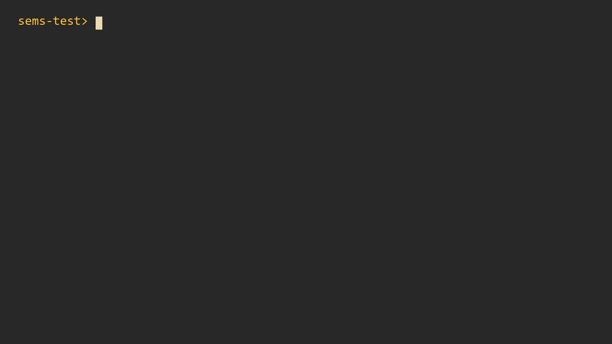

# sems

Semantic search for your files: like `grep`, but it matches meaning instead of exact text. It
searches code, documents, PDFs, photos, audio, and video, all locally.



```console
> sems index
> sems "how do we retry failed requests"
code\retry.ts:1-15  0.82
 1: export async function fetchWithBackoff(url: string, attempts = 5): Promise<Response> {
 2:   let delayMs = 250;
 ...

> sems "can I have a dog in my flat"
docs\lease_agreement.pdf  page 2  0.73
    2. Pets
    The Tenant may keep one cat or one small dog with the Landlord's written consent.
    ...

> sems "a rocket launch"
videos\clip_0001.mp4  0:09-0:18  0.74  [video]

photos\IMG_0003.jpg  0.73  [image 512x342]

> sems "when is the dentist appointment"
audio\memo_0003.m4a  0:00-0:30  0.69  [audio]
```

Powered by [EmbeddingGemma 2](https://huggingface.co/google/embeddinggemma-2). Nothing leaves your
machine.

## Usage

```text
sems <QUERY> [PATH]        search under PATH (default: current directory)
    -n, --limit <N>        number of results (default 10)
    -l                     print matching file paths only
        --json             results as JSON, for scripts and coding agents
        --kind <KIND>      only text, image, pdf, audio, or video
        --all              also show weak results
sems index [PATH]          index PATH, or update it after changes
        --skip-images, --skip-audio, --skip-video
        --rebuild          start the index over
sems status [PATH]         what is indexed under PATH
sems gpu install           faster indexing on NVIDIA GPUs (Windows, Linux; ~1 GB download)
sems gpu remove            delete it again
```

- Indexing skips whatever `.gitignore` or a `.semsignore` file lists, plus hidden and binary files.
  Re-indexing only processes files that changed.
- Searches show only the results that clearly stand out; `--all` shows everything.
- Result paths are clickable in terminals that support links.
- Audio and video need [ffmpeg](https://ffmpeg.org) on your `PATH` (`winget install Gyan.FFmpeg`).
- Indexing uses your GPU when it can. Photos, audio, and video are slow to index without one.

## Install

macOS (Apple silicon) and Linux (x64):

```console
curl --proto '=https' --tlsv1.2 -LsSf https://github.com/IgnacioSearles/sems/releases/latest/download/sems-installer.sh | sh
```

Windows (x64):

```console
powershell -ExecutionPolicy Bypass -c "irm https://github.com/IgnacioSearles/sems/releases/latest/download/sems-installer.ps1 | iex"
```

The first time it needs them, sems downloads ONNX Runtime (15–40 MB) and its model: about 550 MB
for searching text, plus about 350 MB for photos and video and about 620 MB for audio. Everything
comes from official sources and is checked against hashes built into sems. It lives in your local
data folder (`%LOCALAPPDATA%\sems`, `~/.local/share/sems`, or `~/Library/Application Support/sems`).
To use other locations, set `SEMS_INDEX`, `SEMS_MODEL_DIR` (a local export, used as is),
`SEMS_ONNXRUNTIME`, or `SEMS_FFMPEG` (or the matching flags).

With an NVIDIA GPU (driver 580 or newer), `sems gpu install` adds the CUDA pack, and indexing then
runs several times faster. Other GPUs are used through DirectML on Windows; on macOS sems runs on
the CPU.

To build from this checkout on Windows: `powershell -ExecutionPolicy Bypass -File tools\install\install.ps1`.

## Releasing

Set the new version in `Cargo.toml`, commit, then tag and push it (`git tag v0.2.0 && git push --tags`).
The release workflow builds every platform and publishes the GitHub release with the installers.

## Updating the model

Export it (needs Python 3.13), upload it, then pin the new commit and file hashes in
`src/model_download.rs`:

```console
python -m venv tools/export/.venv
tools/export/.venv/Scripts/pip install -r tools/export/requirements.txt --extra-index-url https://download.pytorch.org/whl/cpu
tools/export/.venv/Scripts/python -c "from huggingface_hub import snapshot_download; snapshot_download('google/embeddinggemma-2', local_dir='models/embeddinggemma-2')"
tools/export/.venv/Scripts/python tools/export/make_reference.py --model models/embeddinggemma-2 --out models/reference.json --images tests/fixtures/images/beach.png --audio tests/fixtures/eval_corpus/audio/memo_0001.wav tests/fixtures/eval_corpus/audio/memo_0003.m4a --videos tests/fixtures/eval_corpus/videos/clip_0001.mp4
tools/export/.venv/Scripts/python tools/export/export_onnx.py --model models/embeddinggemma-2 --out models/onnx --reference models/reference.json --image tests/fixtures/images/beach.png --audio tests/fixtures/eval_corpus/audio/memo_0001.wav tests/fixtures/eval_corpus/audio/memo_0003.m4a --video tests/fixtures/eval_corpus/videos/clip_0001.mp4
cp tools/export/model_card.md models/onnx/README.md
hf upload neich-cereales/sems-embeddinggemma-2-onnx models/onnx .
```

The export fails unless every graph reproduces the official embeddings.

## Tests

```console
cargo test --release
SEMS_ONNXRUNTIME=$LOCALAPPDATA/sems/runtime/directml/onnxruntime.dll cargo test --release -- --ignored --test-threads=1
```

The first needs no model. The second checks the model against the official implementation and
measures search quality on the labelled files in `tests/fixtures`.
